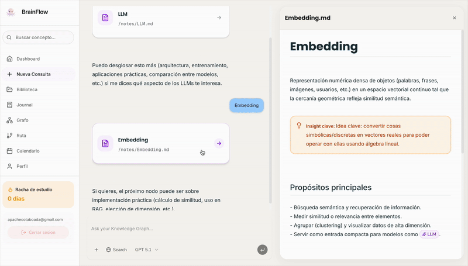
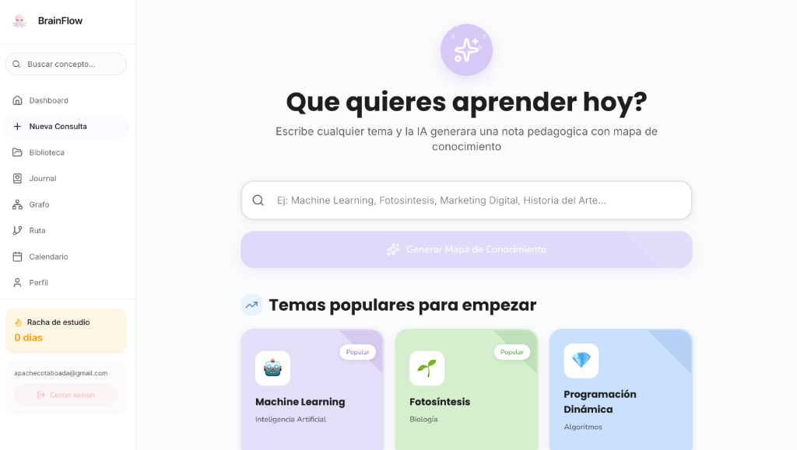
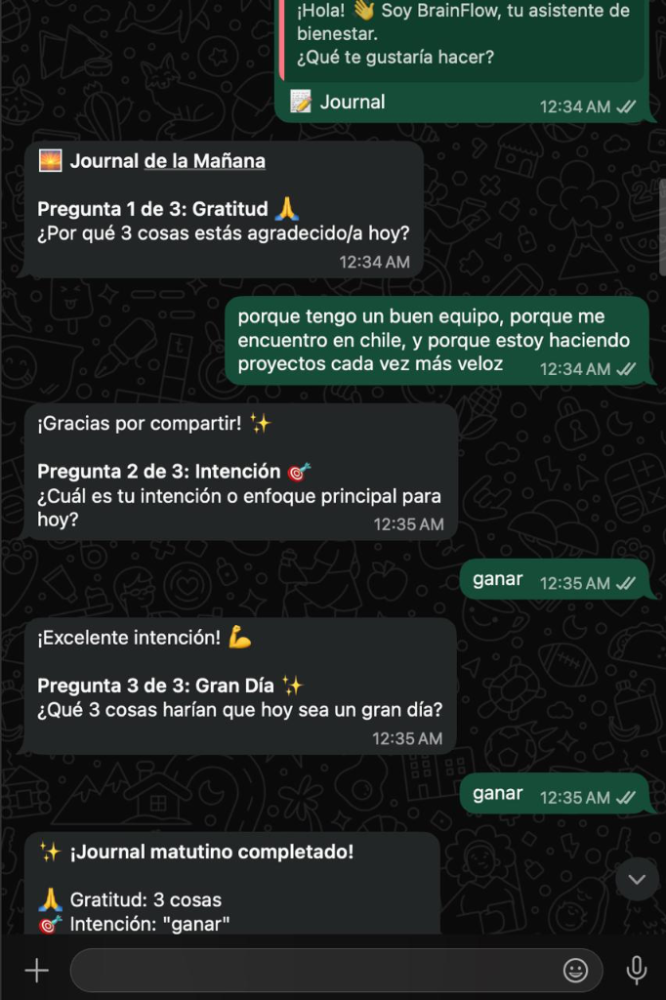
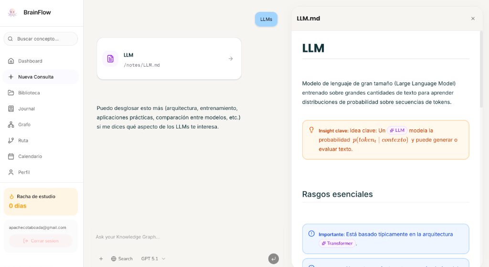
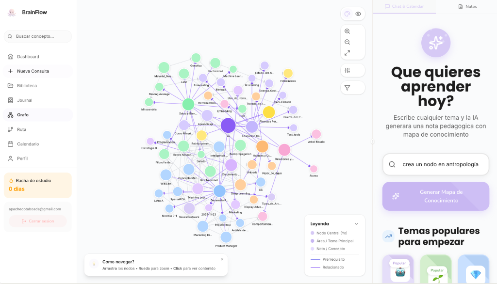
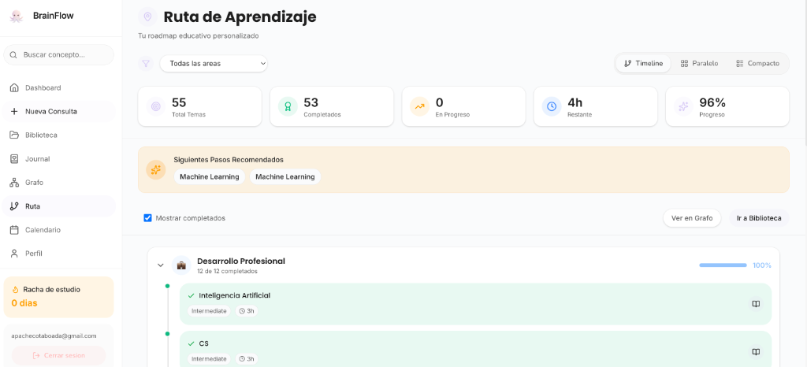
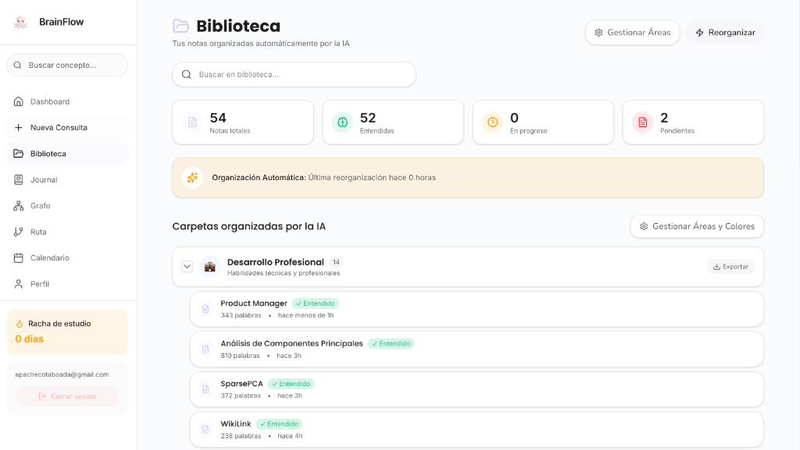
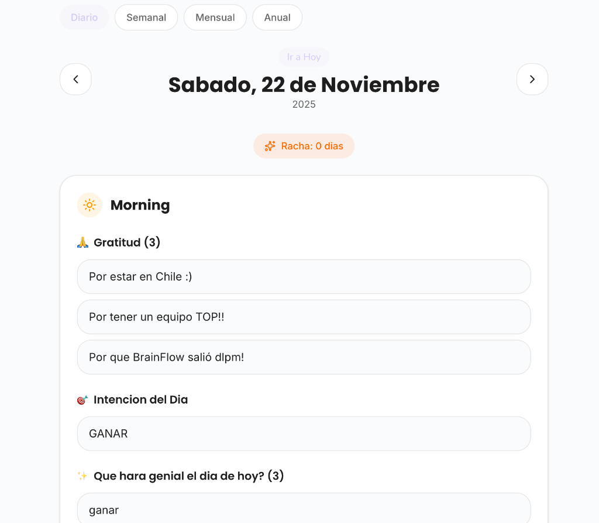
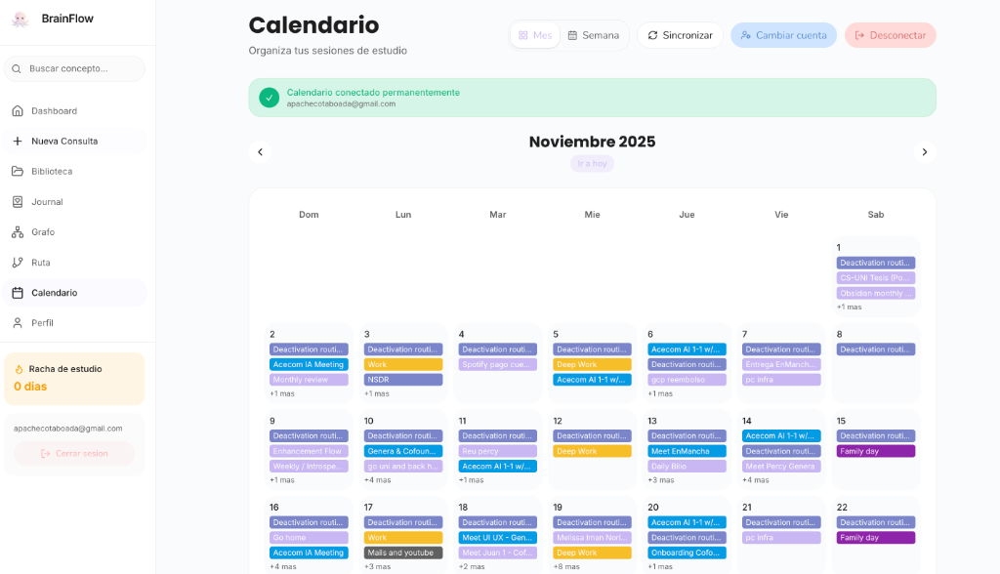
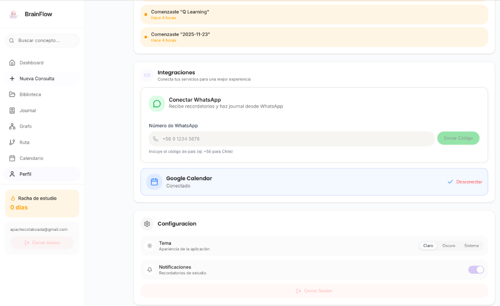

| Project Logo | Submission Details |
| :---: | :--- |
|  | **Deadline:** 23rd Nov, 9:00 AM<br>**Track:** 🦾 Human Enhancement |

### Team Members
| Name | GitHub |
| :--- | :--- |
| Alvaro Giovanni Zuñiga Canazas | [@alvarogiozu](https://github.com/alvarogiozu) |
| Melissa Iman Noriega | [@Melissa1221](https://github.com/Melissa1221) |
| André Joaquín Pacheco Taboada | [@A-PachecoT](https://github.com/A-PachecoT) |

---

# BrainFlow 🧠✨


> **Tu cerebro no es una lista de archivos. ¿Por qué tus notas sí?**
> BrainFlow transforma el caos de tus ideas en un **Grafo de Conocimiento Vivo**.

<div align="center">
  
</div>

Hoy en día, tu vida digital está fragmentada: tus emociones en un diario, tu conocimiento en notas y tu tiempo en un calendario. **BrainFlow** unifica **Journaling, Note-taking y Scheduling** en un solo sistema vivo.

Más que una herramienta, es **Human Enhancement**: un segundo cerebro activo que conecta lo que sientes, lo que sabes y lo que haces. Utilizando IA avanzada, BrainFlow no solo almacena información, sino que la organiza, la conecta y te ayuda a navegar tu propia mente.

<!-- Demo Link Placeholder: Add link here when available -->
<!-- [Ver Demo en Vivo](https://brainflow.app) -->

---

## 🧠 La Magia: El Primer Deep Agent PKM

BrainFlow no es un simple RAG (Retrieval-Augmented Generation) que "lee" trozos de texto. Es un **Sistema Agéntico Profundo** con acceso directo a un Sistema de Archivos Virtual (VFS).

### ¿Por qué Deep Agents?
Un "Segundo Cerebro" no debe ser pasivo. Necesita **actuar**.
A diferencia de los sistemas tradicionales que solo *buscan* información mediante vectores, nuestro agente tiene herramientas reales (`ls`, `mkdir`, `write_file`) para **gestionar** tu conocimiento activamente, tal como lo harías tú.



Puedes conversar con Nodi en la web o en WhatsApp:


### 1. Ingesta Multimodal 📥
El conocimiento llega desde todas partes. BrainFlow lo centraliza:
- **Voz (WhatsApp)**: Envía audios reflexionando sobre tu día.
- **Texto**: Notas rápidas en markdown enriquecido.
- **Archivos**: PDFs y documentos de estudio.

### 2. El Cerebro: DeepAgents + VFS 🤖
En lugar de depender de búsquedas vectoriales opacas, usamos un agente autónomo que vive dentro de tu grafo:
- **Exploración Activa**: El agente navega la estructura de carpetas del VFS para entender el contexto real.
- **Organización Inteligente**: Decide dónde guardar cada nota y cómo categorizarla en tu jerarquía.
- **Gestión de Archivos**: Crea, edita y mueve archivos Markdown reales en Supabase.



### 3. El Grafo Vivo 🕸️
- **Conexiones Lógicas**: El agente deduce relaciones basándose en el contenido y la estructura, creando un grafo semántico real.
- **Ghost Nodes**: La IA predice conceptos adyacentes que *deberías* aprender, mostrándolos como nodos fantasma translúcidos.



### 4. Nodi: Tu Tutor Socrático 💬
No es un chatbot genérico. Nodi tiene acceso de lectura/escritura a tu grafo:
- **Contexto Estructural**: Entiende la jerarquía y profundidad de tus notas.
- **Pedagogía Activa**: No solo da respuestas; hace preguntas para reforzar tu aprendizaje y genera rutas de estudio personalizadas.



---

## 🚀 Características Principales

### 1. 🕸️ Visualización Neuronal
Navega por tu conocimiento como si fuera un mapa estelar.
- **Layout de Fuerza**: Los conceptos relacionados se atraen magnéticamente.
- **Exploración No Lineal**: Salta de una idea a otra siguiendo el hilo de tu pensamiento.



### 2. 📓 Journaling Cuantificado
Tu diario, pero con datos.
- **Voice-to-Insight**: Cuéntale tu día a WhatsApp; BrainFlow extrae patrones y mood.
- **Correlaciones**: "¿Estudio mejor cuando estoy feliz?" BrainFlow te da la respuesta visualizando tus rachas y emociones.




### 3. 📅 Hub de Calendario Inteligente
Tu tiempo, optimizado por IA.
- **Smart Blocking**: Sugerencias de estudio basadas en tus biorritmos y huecos libres.
- **Sincronización Bidireccional**: Integración total con Google Calendar para que tu aprendizaje sea parte de tu vida.

<div align="center">
  <video src="./public/screenshots/WebChatbot_Calendar_resized.mp4" controls width="100%"></video>
</div>



### 4. 🔌 Integraciones
Conecta tu vida digital.
- **WhatsApp**: Captura ideas al vuelo.
- **Google Calendar**: Sincronización bidireccional.




---

## 📂 Estructura del Proyecto

```bash
src/
├── app/                    # Next.js App Router
│   ├── (main)/             # Rutas principales (Dashboard, Grafo, Chat)
│   └── api/                # Endpoints de API (Chat, Webhooks)
├── components/
│   ├── features/           # Componentes complejos (GraphPanel, NotePanel)
│   ├── ui/                 # Componentes base (Radix UI, Shadcn)
│   └── views/              # Vistas completas (ChatView, TreeView)
├── lib/
│   ├── ai/                 # Lógica de IA (DeepAgents, Prompts, Tools)
│   ├── google/             # Integración Google Calendar
│   ├── hooks/              # Custom React Hooks
│   ├── store/              # Estado global (Contexts)
│   └── supabase/           # Cliente y tipos de Supabase
└── styles/                 # Configuración de Tailwind y CSS global
```

---

## 🛠️ Stack Tecnológico

*   **Framework**: [Next.js 16](https://nextjs.org/) (App Router)
*   **Lenguaje**: [TypeScript](https://www.typescriptlang.org/)
*   **Estilos**: [Tailwind CSS 4](https://tailwindcss.com/) + [Radix UI](https://www.radix-ui.com/) (Soporte nativo Light/Dark/System)
*   **Base de Datos**: [Supabase](https://supabase.com/) (PostgreSQL)
*   **IA**: [OpenAI GPT-4o](https://openai.com/) + [Vercel AI SDK](https://sdk.vercel.ai/docs)
*   **Visualización**: [Cytoscape.js](https://js.cytoscape.org/)
*   **Integraciones**: Twilio (WhatsApp), Google Calendar API

---

## 🏁 Empezando

### Prerrequisitos
- Node.js 18+
- Cuenta de Supabase
- API Key de OpenAI

### Instalación

1.  **Clonar el repositorio**
    ```bash
    git clone https://github.com/platanus-hack/team-23.git
    cd team-23
    ```

2.  **Instalar dependencias**
    ```bash
    npm install
    ```

3.  **Configurar Variables de Entorno**
    Crea un archivo `.env.local`:
    ```env
    NEXT_PUBLIC_SUPABASE_URL=tu_url
    NEXT_PUBLIC_SUPABASE_ANON_KEY=tu_key
    OPENAI_API_KEY=tu_key
    ```

4.  **Correr el servidor de desarrollo**
    ```bash
    npm run dev
    ```

5.  Abre [http://localhost:3000](http://localhost:3000) en tu navegador.

---

## 🦾 Track: Human Enhancement

BrainFlow encaja en el track de **Human Enhancement** al aumentar la cognición humana en tres dimensiones:
1.  **Memoria**: Externalizando el conocimiento en un grafo persistente e interconectado.
2.  **Inteligencia**: Proporcionando un socio de IA que facilita la comprensión profunda, no solo la recuperación de información.
3.  **Autorregulación**: Usando datos (journaling/calendario) para optimizar el estado mental del usuario para el aprendizaje.

---

*Developed with ❤️ by Team-23 for Platanus Hackathon 2025*
